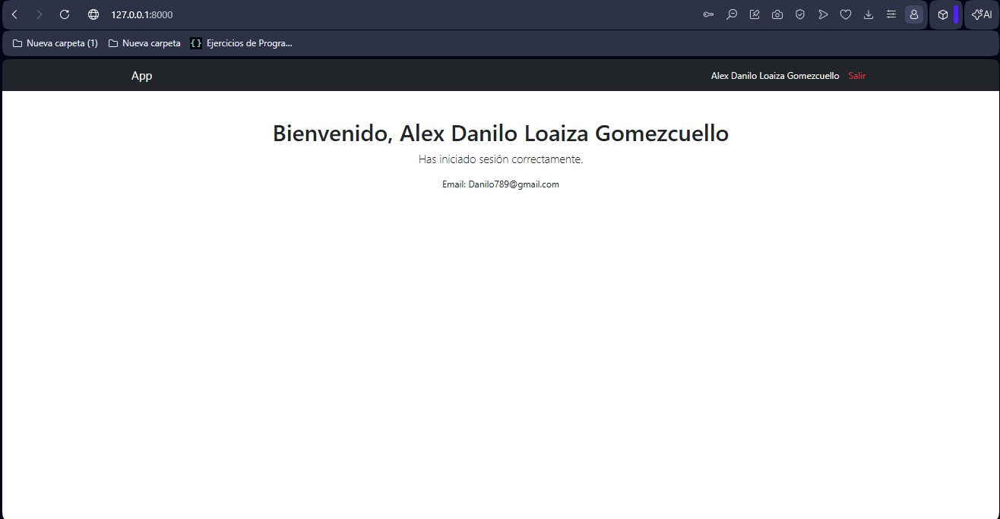

# Laboratorio Django - POO

## 👥 Integrantes
* **Alex Danilo Loaiza Gomezcuello**
* **Michael Alberto Menendez Barzola**
* **Marlon Steven Bejarano Muñoz**
* **Christian Adolfo Mora Anchundia**

### 🎓 Carrera y Semestre
* **Carrera:** Ingeniería en Software
* **Semestre:** Cuarto Semestre

---

## 📝 Descripción breve
Este repositorio contiene la configuración base de un proyecto Django desarrollado para la asignatura de **Programación Orientada a Objetos**.

El proyecto incluye la creación del entorno virtual, instalación de dependencias, configuración del módulo principal `config`, conexión con MySQL y desarrollo de la aplicación `security` para manejar usuarios y autenticación.

---

## 🔄 Resumen de pasos realizados
1. Se creó y activó un entorno virtual de Python para aislar las dependencias del proyecto.
2. Se instaló Django y se generó el proyecto base con el módulo `config`.
3. Se configuró el archivo `.env` para manejar variables de entorno.
4. Se conectó Django con una base de datos MySQL llamada `ventas_db_local`.
5. Se creó la aplicación `security` para gestionar usuarios y autenticación.
6. Se implementó un modelo de usuario personalizado usando email como campo principal de inicio de sesión.
7. Se aplicaron las migraciones y se creó un superusuario.
8. Se configuraron las rutas, vistas y plantillas para el login, logout y página principal protegida.
9. Se verificó el funcionamiento del servidor Django en entorno local.

---

## 🚀 Captura del servidor Django corriendo
El servidor de desarrollo fue ejecutado correctamente en la dirección local:

> 🌐 [http://127.0.0.1:8000/](http://127.0.0.1:8000/)


---

## 💻 Comandos principales utilizados

```bash
# Creación y activación del entorno virtual
python -m venv .venv
source .venv/Scripts/activate

# Instalación de dependencias
pip install Django python-decouple mysqlclient Pillow

# Configuración del proyecto y la app
django-admin startproject config .
python manage.py startapp security

# Base de datos y migraciones
python manage.py makemigrations
python manage.py migrate
python manage.py createsuperuser

# Ejecución del servidor
python manage.py runserver